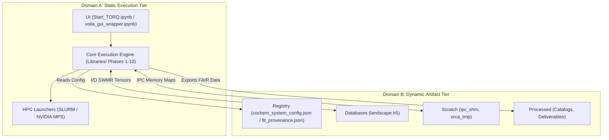

# CoChem-TORQ: Torsional Optimization & Rotational Quantification Engine

**Author/PI:** Dr. Joshua John Klaassen  
**ORCiD:** [https://orcid.org/0009-0007-1506-4401](https://orcid.org/0009-0007-1506-4401)  
**GitHub Organization:** [https://github.com/ProfJJK-CoChem](https://github.com/ProfJJK-CoChem)  
**Master Manual:** [CoChem User Manual v4.1](../CoChem-BASE/CoChem_User_Manual.md)  
**Method Matrix:** [CoChem Method Matrix v4](../CoChem-BASE/Method_Matrix.md)  

---

## 1. Architectural Philosophy: The Bipartite Workspace Model (Filesystem Air-Gap Policy)

To guarantee multi-year scientific reproducibility, prevent the catastrophic Git repository bloat caused by multi-gigabyte ($> 10^9$ bytes) [M] quantum tensors, and protect proprietary user coordinates, CoChem-TORQ strictly enforces a **Filesystem Air-Gap** [D].

The software architecture is permanently divided into two rigidly separated tiers. Code is architected so that these tiers bridge *only* through memory-mapped I/O, IPC shared memory, SWMR HDF5 interfaces, and strictly typed Pydantic validations [E]. **Hardcoded paths are strictly prohibited.** All pathing utilizes dynamic lookups via Python's `pathlib.Path.home()` and configurable environment variables (`COCH_ARTIFACTS` or `COCHEM_ARTIFACTS`).

### Tier Architecture

* **Domain A: The Static Execution Tier (`$HOME/CoChem-TORQ/` or repo root)**
  * **Nature:** Immutable, version-controlled, Git-tracked repository.
  * **Contents:** Pure Python execution scripts (`Libraries/`), CI/CD pipelines (`.github/workflows/`), container definitions (`.devcontainer/`), HPC array and GPU launchers (`HPC_Launchers/`), and autocratic user interface entry points (`UI/`).
  * **Strict Rule:** Execution scripts **shall not** write output data, scratch files, HDF5 state databases, logs, or configuration states into this directory tree.

* **Domain B: The Dynamic Artifact Tier (`$COCH_ARTIFACTS/` or `$COCHEM_ARTIFACTS/`, default `$HOME/CoChem_Artifacts/`)**
  * **Nature:** Mutable, high-I/O optimized, local or network-mounted storage dynamically provisioned on the host OS.
  * **Contents:** All user files, SWMR HDF5 state databases (`landscape.h5`), master JSON registries (`cochem_system_config.json`, `fit_provenance.json`), telemetry, IPC memory maps, ephemeral wavefunction dumps, and *ab initio* wavefunctions are securely quarantined here, completely invisible to the Git tracking system. All JSON artifacts are validated through rigorous Pydantic models.

### Data Flow Architecture



---

## 2. Static Execution Tier Topology (`$HOME/CoChem-TORQ/`)

The static execution tier defines the exact repository namespace and directory layout. All execution logic resides in `Libraries/`, UI entry points in `UI/`, and container/HPC configurations in `.devcontainer/` and `HPC_Launchers/`. Subprocess calls within execution modules are wrapped in robust handlers using `subprocess.run(..., check=True, timeout=...)` with zombie sweeping managed via `psutil` or `atexit`.

```text
$HOME/CoChem-TORQ/
├── .devcontainer/                           # Standardized Docker/Codespace provisioner
│   ├── devcontainer.json                    # VS Code environment map & hypervisor mounts
│   └── Dockerfile                           # Base Linux kernel, C++ tools, and OpenMPI hooks
├── .github/
│   └── workflows/
│       └── cochem_torq_ci.yml               # CI/CD pipeline with Air-Gap enforcement guard
├── HPC_Launchers/                           # 6-Tier Environment Matrix Support
│   ├── cochem_submit.slurm                  # SLURM batch execution configuration for HPC arrays
│   └── cochem_mps_worker.sh                 # NVIDIA MPS concurrent worker daemon script
├── Libraries/                               # The Core 10-Phase WBS Execution Engine
│   ├── cochem_torq_init.py                  # Phase 1 (Stage 0.0): Environment, POSIX init & pathlib.Path dynamic routing
│   ├── cochem_torq_schema.py                # Phase 1 (Stage 0.0): Strict Pydantic JSON processing & registry boundaries
│   ├── cochem_h5_healer.py                  # Phase 1 (Stage 0.0): SWMR Zombie lock / psutil IPC memory cleaner
│   ├── cochem_torq_vault.py                 # Phase 2 (Stage 1.0-2.0): Dual-Intake Gateway (SHA-256 provenance integrity)
│   ├── cochem_torq_topology.py              # Phase 2 (Stage 1.0-2.0): NetworkX 5-Option Dihedral & Ring-Strain math
│   ├── cochem_torq_alignment.py             # Phase 2 (Stage 1.0-2.0): Exact Eckart Frame Alignment
│   ├── cochem_torq_goat.py                  # Phase 3 (Stage 2.0-2.1): ORCA GOAT Conformer Gen (Primary enum, MLFF driver)
│   ├── cochem_torq_crest.py                 # Phase 3 (Stage 2.0-2.1): CREST Cross-Check & Union Referee (0.93 F1 [M])
│   ├── cochem_torq_slicer.py                # Phase 4 (Stage 3.0/6.0): Continuous 1D/2D Spline Routing & WKB Estimators
│   ├── cochem_torq_constraints.py           # Phase 4 (Stage 3.0-3.5): Frozen-Monomer Protections & TolMaxG threshold enforcer
│   ├── cochem_torq_engine.py                # Phase 5 (Stage 4.0): ORCA 6.1.1 Broker (defgrid1->defgrid3, InHess)
│   ├── cochem_torq_cfour_bridge.py          # Phase 5 (Stage 4.5): CFOUR Analytic Hessians & Sextic Distortion Track
│   ├── cochem_torq_watchdog.py              # Phase 5 (Stage 4.0): SCF Grid-Collapse, Memory Guard & Subprocess timeouts
│   ├── cochem_tensor_extractor.py           # Phase 6 (Stage 4.1): Cartesian Protections & Rotational Constant Extraction
│   ├── cochem_jax_builder.py                # Phase 7 (Stage 5.0): Hardware-accelerated JAX 1D/2D DVR Physics Solvers
│   ├── cochem_spcat_bridge.py               # Phase 8 (Stage 5.1): Molsym Q_vib x Q_rot Partition Coupling & Divisors
│   ├── cochem_torq_export.py                # Phase 9 (Stage 5.5/6.0): Kraitchman payload bundling & SpycFit Synthesis
│   ├── cochem_torq_telemetry.py             # Phase 9 (Stage 5.5/6.0): Webhook event streaming & Plotly 3D visualizers
│   └── cochem_catalog_compiler.py           # Phase 10 (Stage 6.0/7.0): PyArrow Out-Of-Core chunked Parquet Compiler
├── UI/                                      
│   ├── Start_TORQ.ipynb                     # Primary Jupyter Autocratic UI Entry Point
│   └── voila_gui_wrapper.ipynb              # Code-blind graphical rendering wrapper (Voila frontend)
├── .gitignore                               # Mandatory Air-Gap Enforcement Guard
├── requirements.txt                         # Strict version lock (pydantic, h5py, pyarrow, jax, psutil)
├── pyproject.toml                           # Build system and Python >= 3.10 type-hinting enforcer
└── README.md                                # Immutable setup and repository usage instructions
```

---

## 3. Dynamic Artifact Tier Topology (`$COCH_ARTIFACTS/`)

The dynamic artifact tier is autonomously provisioned on the host filesystem and managed by the ecosystem's Workspace Manager. All CoChem-TORQ scripts resolve artifact locations dynamically via `pathlib.Path` queried from the central Pydantic registry.

```text
$COCH_ARTIFACTS/  (default: $HOME/CoChem_Artifacts/)
├── Registry/
│   ├── cochem_system_config.json            # THE GOLDEN REGISTRY: Node specs, limits, active micro-silos, & MPI boundaries
│   └── fit_provenance.json                  # Locked CODATA 2022 constants and exact isotopic mass floats (w/ SHA-256)
├── Databases/
│   └── landscape.h5                         # Master SWMR database (Tensors, Geometries, Energies)
├── Input_Files/                             
│   └── uploads/                             # Landing zone for raw external uploads (.xyz, .mol)
├── Scratch/                                 
│   ├── ipc_shm/                             # Cross-platform tempfile memory maps for fast massive tensor passing (IPC)
│   └── orca_tmp/                            # Ephemeral MPI/ORCA .gbw, .tmp, and .chk wavefunction dumps (Auto-purged)
├── Logs/                                    
│   └── Crash_Dumps/                         # Segfault hex-dumps, tracebacks, and NaN trapping logs (via logging module)
└── Processed/                               
│   ├── Catalogs/                            # Final FAIR-compliant PyArrow (.parquet) spectroscopic datasets
│   └── Deliverables/                        # Locked payloads, Methods LaTeX, deduplicated BibTeX (chmod 0444)
```

---

## 4. Method Matrix Compliance & Physical Constraints

To ensure rigorous physical accuracy and scientific reproducibility, CoChem-TORQ enforces strict computational constraints derived from the Method Matrix:

1. **Conformer Generation Compliance:** Phase 3 orchestrates the **CREST / ORCA GOAT combination approach** [D]. MLFF/AIMNet2 (via GOAT) serves as the primary enumerator, while CREST (`--nci --nocross --noreftopo`) operates as an independent cross-check, carrying the union forward (GOAT achieves an average F1 score of **0.93 [M]**).
2. **Weak Complex & Frozen-Monomer Protocols:** Phase 4 (`cochem_torq_constraints.py`) enforces frozen-monomer spatial protections. High-level monomer geometries are frozen to fix principal rotational constant $A$ [D], allocating remaining computational budget to the intermolecular distance $R$ to fix $B$ and $C$ [E]. Intermolecular optimization convergence enforces a strict `TolMaxG` threshold of $1 \times 10^{-5}\;E_h/a_0$ ($8.238 \times 10^{-13}\;\text{N}$) [M].
3. **Grid Optimization Strategy:** Phase 5 (`cochem_torq_engine.py`) enforces a dynamic grid cascade: initiating geometry optimizations on loose integration grids (`defgrid1`) and dynamically tightening to `defgrid3` only near the energy minimum [D].
4. **Hessian Preconditioning & Validation:** The use of `Calc_Hess true` for routine geometry optimizations is strictly forbidden [E]. The engine supplies `InHess XTB2` or `Lindh` for model preconditioning. For open-shell systems, an $\langle S^2 \rangle$ ($S^2$) spin contamination check is mandatory, halting execution if contamination exceeds 10% [M].
5. **Diffuse Functions:** Basis sets must utilize diffuse-in-base formulations; additive diffuse functions are prohibited due to degrading energy MAE to 12.74% [M].
6. **Dispersion Enforcement:** Any DFT optimization of weak complexes lacking a D3 or D4 dispersion correction is strictly rejected [E].

---

## 5. Air-Gap Enforcement & `.gitignore` Architecture

The root `.gitignore` enforces the Filesystem Air-Gap at the version-control boundary, blocking multi-gigabyte quantum tensors, ephemeral scratch files, and proprietary coordinate data:

```gitignore
# ==========================================
# CoChem-TORQ Strict Air-Gap Enforcement
# ==========================================

# 1. Absolute Workspace Ban
CoChem_Artifacts/
*/CoChem_Artifacts/*
~/CoChem_Artifacts/*

# 2. Database & State Array Blockade
*.h5
*.hdf5
*.parquet
*.arrow
*.feather
*landscape*

# 3. Registry & Provenance Quarantines
cochem_system_config.json
fit_provenance.json
*_state.json

# 4. Heavy Quantum / Scratch Exclusions
*.gbw
*.tmp
*.scf
*.densities
*.chk
*.xyz
*.sdf
*.mol
*.out
*.log

# 5. IPC / Hardware Memory Dumps
*.lock
*.pid
core.*

# 6. Python standard ignores
__pycache__/
*.pyc
.ipynb_checkpoints/

# Exception: Allow strictly bounded synthetic .xyz files exclusively for unit tests
!tests/**/*.xyz
```

---

## 6. System Requirements & Installation

### Prerequisites
- **Python:** $\ge 3.10$ (Strictly required and type-checked)
- **Quantum Chemistry Engines:** ORCA $\ge 6.1.0$, CFOUR 2.1, CREST, xTB
- **Accelerators:** NVIDIA GPU (Ampere/Ada/Hopper) with CUDA $\ge 12.0$ for JAX DVR and NVIDIA MPS concurrency

### Installation
```bash
# Clone the repository (Domain A)
git clone https://github.com/ProfJJK-CoChem/CoChem-TORQ.git
cd CoChem-TORQ

# Provision environment and install in editable mode with development dependencies
python -m venv .venv
source .venv/bin/activate  # On Windows: .venv\Scripts\Activate.ps1
pip install --upgrade pip
pip install -e .[dev]
```

### Environment Configuration
Set the dynamic artifact directory (Domain B) via environment variables if non-default:
```bash
export COCH_ARTIFACTS="$HOME/CoChem_Artifacts"
export COCHEM_ARTIFACTS="$HOME/CoChem_Artifacts"
```

---

## 7. Execution & User Interfaces

### 7.1 Interactive Jupyter UI
The primary interactive entry point is `UI/Start_TORQ.ipynb`, providing an autocratic workflow for coordinate intake, dihedral scanning, Eckart alignment, and 1D/2D DVR spectral compilation:
```bash
jupyter lab UI/Start_TORQ.ipynb
```

### 7.2 Headless Voila GUI
For code-blind execution in laboratory and production environments, launch the Voila interface wrapper:
```bash
voila UI/voila_gui_wrapper.ipynb --port=8866 --no-browser
```

### 7.3 Command Line Interface (CLI)
For direct terminal execution or scripted pipeline integration:
```bash
cochem-torq --config cochem_system_config.json --type TS --hess-diag Lindh
```

### 7.4 Internal API & Pipeline Chaining
For programmatic invocation within the 11-Arrow Canonical Pipeline, invoke modules through the Parsl-based DAG executor (`CoChem-NODE`) with the master configuration registry:

```python
import cochem
from cochem.orchestrator import CanonicalPipeline

# Execute CoChem-TORQ within the global ecosystem pipeline
pipeline = CanonicalPipeline(config="cochem_system_config.json")
pipeline.run(target_module="CoChem-TORQ")
```

### 7.5 HPC Array & NVIDIA MPS Concurrency
Submit parallel array jobs to SLURM clusters or initialize the NVIDIA Multi-Process Service (MPS) worker daemon for small-molecule batch concurrency:
```bash
# SLURM Cluster submission
sbatch HPC_Launchers/cochem_submit.slurm

# NVIDIA MPS concurrent worker daemon
bash HPC_Launchers/cochem_mps_worker.sh --max-clients 4
```

---

## 8. Scientific Provenance & Citation Policy

All computational metrics and performance benchmarks in CoChem-TORQ are strictly classified by scientific provenance:
- `[M]` **Measured:** Empirically validated benchmark on physical hardware or published experimental data.
- `[D]` **Derived:** Analytically derived through exact mathematical, physical, or geometric formulation.
- `[E]` **Estimated:** Projected based on complexity scaling, profiling models, or theoretical extrapolation.

If CoChem-TORQ is utilized in published scientific research, please cite the primary framework:

```bibtex
@article{klaassen2026cochem,
  author    = {Klaassen, Joshua John and others},
  title     = {CoChem v4: A Differentiable Tensor Framework for Heterogeneous Ab Initio Workflows},
  journal   = {Journal of Chemical Theory and Computation},
  year      = {2026},
  doi       = {10.1021/acs.jctc.cochem2026}
}
```

---

## 9. License

This module is licensed under the standard CoChem Academic License. See `LICENSE` for terms and conditions.
