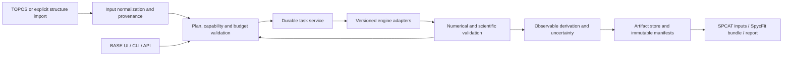

# CoChem-TORQ implementation specification

Version: 1.1, approved spectroscopy scope and integrity contracts. Reviewed source: `d7a4739a5f7d6f22ed659b32eeb4706bef16225e`; implementation repairs are tracked separately. Updated 2026-10-07, America/Chicago.

This specification defines what to implement and how to establish that it works. It does not certify the current implementation, an unexecuted engine capability, or publication-level accuracy. The repository has material implementation defects; see [implementation audit](review/Architecture_Implementation_Audit.md). Significant scientific and operational choices are recorded in the [decision register](review/Decisions_and_Risks.md). Requirements for gated features are specified here so they can be implemented without mistaking a research proposal for a supported result.

## 1. Document control, interpretation, and scope

### 1.1 Authority and traceability

This document is the canonical TORQ implementation SRS. The [method implementation contract](Method_Matrix_Implementation_Contract.md) governs translation of the historical matrix into executable recipes. The [source review](review/SRS_Point_Review.md), [matrix review](review/Method_Matrix_Review.md), and [reference audit](review/Scientific_References.md) retain the rationale and source locations. Earlier True SRS, Iterated SRS, Comprehensive SRS, AutoArchitect, integration notes, and coding manifest are historical inputs except where explicitly adopted here. Their conversational claims of completed audits, placeholders, and unverified performance assertions are not acceptance evidence.

`SHALL` denotes a release requirement; `SHOULD` a recommendation whose deviation must be explained in the run record; `MAY` an optional capability. Requirements are identified as `TORQ-<area>-<number>`. Acceptance tests are identified in §15. A requirement applies to an enabled feature profile; an unavailable profile must report why it is unavailable. Core requirements cannot be satisfied by marking core behavior optional. A feature is supported only after its specific acceptance gate passes.

**TORQ-GOV-001 — Evidence and truthful status.** Every advertised feature SHALL have a versioned capability entry, associated tests, and actual results. A file, class, example input, citation, or green lint run is insufficient evidence of physical execution. Missing observables SHALL remain missing with a reason; fabricated frequencies, zero-filled dipoles, inferred success, or copied input geometry labeled optimized are forbidden. Acceptance: V-FAIL and V-RELEASE.

**TORQ-GOV-002 — Bounded change.** Low-risk corrections adopted in this revision concern scientific definitions, explicit contracts, provenance, error handling, traceability, and verification. Material changes to scientific models, scope, resource use, or licensing SHALL follow the decision register. An unresolved decision disables the dependent automatic behavior, not independent supported workflows. Acceptance: V-PLAN.

Accepted user decisions D01–D12 and ARCH-01–ARCH-12 retain the complete nine-stage typed spectroscopy chain through high-accuracy rotational identification and select the development policies recorded in §17. Exact open-source revDSD retains separate energy/response-gradient/higher-derivative qualification; ML is advisory first and electronic analyses are optional and individually named. Acceptance of development scope does not certify an unavailable backend or waive its scientific gates. The [revDSD and spectroscopy protocol](RevDSD_Spectroscopy_Protocol.md) defines the selected engine-development route and qualification experiments.

### 1.2 Intended users and products

TORQ serves computational chemists, microwave spectroscopists, students, and operators of shared compute resources. Its initial research domain is isolated gas-phase molecules and weakly bound complexes, especially 5–10 atom dimers, on a specified ground-state Born–Oppenheimer potential. Larger systems, open shells, and additional elements are allowed only within a validated engine/model profile. Method accuracy must be established for the chemical domain, not inferred from atom count.

TORQ consumes candidate structures, refines selected geometries, maps user-selected coordinates and reaction paths, characterizes stationary points, derives supported spectroscopic observables, and exports auditable artifacts. Execution profiles target Linux CPU first, followed by independently qualified named GPU/Slurm and other platform profiles, with optional notebook/Voila interaction managed through BASE. TOPOS owns global conformer discovery. SpycFit owns spectral assignment and fitting. BASE owns shared identity, installation policy, resource brokering, durable task services, and general UI hosting. Existing TORQ discovery adapters must be exposed as upstream integration adapters, not silently run during refinement.

Nonadiabatic photodynamics, general conical-intersection searches, automatic active-space selection, arbitrary-dimensional exact nuclear dynamics, condensed phases, and universal bond classification are outside the supported baseline. Extension interfaces and acceptance conditions may be developed; no baseline result may depend on them silently. Accurate rate calculations are an explicitly enabled kinetics profile, not implied by drawing an energy diagram.

The global matrix's IR/THz, Raman, NMR, UV–visible and mass-spectrometry rows are all reviewed and retained. Accepted D12 assigns TORQ the full rotational core and adjacent spectra to explicit versioned sibling-module handoffs. A validated vibrational/dipole profile may supply requested IR/THz observables; it does not automatically implement the other spectra.

### 1.3 Completion levels

| Level | Required outcome |
|---|---|
| Core development baseline | Installable package, typed contracts, pure numerical kernels, durable state machine, truthful failures, local resource policy, validated adapter framework, versioned export schema. |
| Open-source research profile | At least one real, pinned energy/gradient engine; real optimization, Hessian workflow and numerical validation; supported geometry/isotope/observable products; reproducible reference cases. |
| Engine-specific research profiles | ORCA, CFOUR, GPU4PySCF, MLFF, or other adapters tested separately for each advertised method/derivative/property tuple. |
| Advanced research profiles | VPT2, LAM/DVR, adaptive PES/ML, PI symmetry, density analysis, composites, and kinetics each pass their numerical and scientific gates. |
| Production deployment | End-to-end UI/API/CLI workflows, security, licensed provisioning, cancellation/restart, storage recovery, resource tests, and release manifest pass on the named platform. |
| Publication artifact | The particular result satisfies its scientific validation plan and includes methods, uncertainties/limitations, raw evidence, data/code provenance, and reproducibility instructions. |

Completing a smaller profile does not constitute completion of every planned feature. Section 16 defines the complete implementation sequence and release gates.

## 2. Scientific products and invariants

### 2.1 Product classes

**TORQ-SCI-001 — Product declaration.** Each campaign SHALL declare one or more products: A, absolute de novo prediction; B, experimentally anchored or semi-experimental inference; C, differences such as isotope or conformer shifts; or BENCHMARK, a method/reference comparison. Product B requires identified experimental inputs and their uncertainties. Product C records whether the difference is fully theoretical or anchored to experiment. Training or calibration observations cannot also count as independent validation. Acceptance: V-SCHEMA and V-UQ.

Published error ranges in the historical matrix are contextual observations, not warranties. A single parent rotational spectrum generally does not determine a unique equilibrium geometry. Semi-experimental structure inference must report identifiability, constraints, isotopologue coverage and uncertainty; a scaled geometry is not automatically a semi-experimental equilibrium structure.

### 2.2 Units and conventions

**TORQ-SCI-002 — Canonical units.** Internal electronic-structure records SHALL use bohr, hartree, hartree/bohr gradients and hartree/bohr² Cartesian Hessians. Forces equal minus gradients. Molecular interchange explicitly declares incoming units; user displays may use Å, kJ/mol or kcal/mol. Spectroscopic output uses MHz for rotational/coupling constants, cm⁻¹ for wavenumbers, kelvin for temperatures, and debye for dipoles, with conversions from one versioned constants service. Masses use isotope-specific atomic masses with source and version. Dimensionless coordinates, degrees/radians and mass-weighted normal coordinates must be distinguished. Acceptance: V-UNITS.

No conversion constant may be copied inconsistently between adapters. Every tensor has axis order, shape, units, frame (orientation and origin) and atom order. Energy zeros and reference states are explicit. Absolute energies from different methods or stoichiometries cannot be used as relative-energy rankings.

**TORQ-SCI-003 — State and stoichiometry.** Charge, multiplicity, electron count, element/isotope identity, fragment charges/spins, atom mapping and constraints SHALL be explicit. The electron/multiplicity parity check is necessary but not proof of the correct state. Formal topology cannot uniquely determine spin multiplicity. Changes in chemical identity, fragments, electronic state or model create new lineage records. Acceptance: V-SCHEMA.

### 2.3 Equilibrium, vibrational, and effective constants

For coordinates relative to the center of mass,

\[
I_{\alpha\beta}=\sum_i m_i[(\mathbf r_i\cdot\mathbf r_i)\delta_{\alpha\beta}-r_{i\alpha}r_{i\beta}],\qquad B_\alpha^{\mathrm{Hz}}=\frac{h}{8\pi^2 I_\alpha}.
\]

**TORQ-SCI-004 — Observable identity.** A geometry alone SHALL yield equilibrium/geometry-derived constants, labeled with its method and stationarity status, never ground-state constants by renaming. For a semi-rigid VPT2 model, use the defined convention

\[
B_{\alpha,v}=B_{\alpha,e}-\sum_i\alpha_{i,\alpha}(v_i+\tfrac12),\quad
\Delta B_{\alpha,\mathrm{vib}}=B_{\alpha,0}-B_{\alpha,e},\quad
B_{\alpha,e}^{SE}=B_{\alpha,0}^{exp}-\Delta B_{\alpha,\mathrm{vib}}^{calc}.
\]

All three axes are treated separately. In the equation, i enumerates individual mode components; grouped degenerate modes use the corresponding degeneracy in their zero-point term. A mixed-level correction is labeled composite and lists both geometry and force-field recipes. A low-cost geometry, ordinary Hessian, classical MD trajectory, or point-group flag alone does not provide VPT2 corrections, tunneling splittings, or a full effective rotational Hamiltonian. Acceptance: V-ROT and V-VIB.

For a floppy system, averaging the inverse inertia tensor in a defined body frame is a diagnostic or an explicitly specified reduced model; it is not generally identical to fitted effective rotational constants of a coupled rovibrational Hamiltonian. Exactly linear rotors require dedicated treatment; a quasi-linear bent molecule remains nonlinear and needs conditioning checks and an appropriate rovibrational model, not automatic linear reclassification. A monatomic fragment has no molecular rotational or vibrational modes. Derived linearized error propagation is local: \(\delta B/B\simeq-\delta I/I\), and \(-2\delta R/R\) applies only when the relevant inertia scales as \(R^2\).

For principal axes, the geometric inertial defect is \(\Delta_e=I_c-I_a-I_b=-2\sum_i m_i c_i^2\le0\). Effective ground-state \(\Delta_0\) includes rovibrational effects and may be positive; a sign discrepancy alone cannot invalidate a structure.

**TORQ-SCI-005 — Scientific labels.** Electronic energy, ZPE, thermal enthalpy/free energy, dissociation energies \(D_e/D_0\), activation barriers and measured/fitted observables SHALL be distinct quantities. A D4 correction is not a ZPE correction. Geometric validation is not wavefunction validation. A numerical Hessian converged at a defined stencil is a valid numerical method, not intrinsically spoofed data. Acceptance: V-EXPORT.

## 3. Architecture and ownership



**TORQ-ARC-001 — Layering.** Implement separable modules for domain models, input adapters, recipe/capability registry, planner, BASE task-service client/local executor, engine adapters, numerical analysis, scientific validators, artifact repository, exporters, CLI and thin UI presenters. Domain/numerical modules SHALL not require a running notebook, network, scheduler, proprietary binary, or GPU simply to import. UI actions call the same application service as CLI/API. Acceptance: V-PACKAGE and V-E2E.

**TORQ-ARC-002 — Ownership.** TORQ SHALL consume BASE services through versioned interfaces; duplicated vendored BASE modules must have an explicit ownership/migration policy. Only one authority commits task state. Accepted D08/ARCH-07 starts with a local standalone adapter implementing the BASE service contract through a local SQLite coordinator and fenced attempts. The database remains on the coordinating host's local storage; workers use the coordinator contract, not shared multi-node writes to a SQLite file over NFS. Acceptance: V-STATE and V-HPC.

| Component | Input | Output | Required error behavior |
|---|---|---|---|
| Input adapter | QCSchema/QCIO versioned payload or explicit file import | `MoleculeRecord` + provenance | Reject schema/unit/state ambiguity; retain original bytes. |
| Recipe registry | User recipe and engine profile | Resolved `MethodSpec` + capability evidence | Unsupported/unverified stays unavailable. |
| Planner | Molecule, objectives, coordinate selection, approvals, budget | Immutable `Plan` and DAG | No silent physical substitution; report estimate bounds. |
| Executor | Approved `TaskSpec` | Raw artifacts and `TaskResult` | Bounded process lifetime, durable status, explicit failure. |
| Validator | Raw/parsed outputs and method policy | `ValidationReport` | Missing data or failed checks cannot become pass. |
| Analysis | Validated geometry/derivatives/properties | Derived observables | Record dependency lineage and approximation. |
| Exporter | Eligible observables + conventions | Versioned bundle | Reject unsupported or inconsistent parameterization. |

**TORQ-ARC-003 — Engine adapter interface.** Each adapter SHALL expose `probe()`, `capabilities()`, `prepare(task, workspace)`, `launch(prepared, allocation)`, `poll(handle)`, `cancel(handle)`, `collect(handle)`, and `parse(raw_manifest)`. Preparation is deterministic; raw bytes are immutable. A successful process exit is necessary but insufficient for convergence. Parsers verify normal termination, convergence and requested property presence independently. Acceptance: V-ENGINE and V-FAIL.

## 4. Data contracts and versioning

### 4.1 General schema rules

**TORQ-DATA-001 — Versioned records.** Records SHALL use a strict, machine-readable schema with a semantic schema version, UUID, UTC timestamp, producer version/commit, content digest and extension namespace. Unknown fields outside extensions, missing required fields, nonfinite numerical values, invalid shapes, unknown units, duplicate atom identifiers and inconsistent multiplicities fail validation. Unknown optional extensions may be retained but cannot change execution semantics. Migrations must preserve originals and record old/new digests. Acceptance: V-SCHEMA.

Record UUID, scientific/cache content digest and submission idempotency key are separate identifiers. Canonical JSON hashing uses a declared RFC 8785-compatible UTF-8 serialization profile, excluding the digest/signature fields themselves. Scientific metadata, units, frames, isotope/atom identity, recipe and array shape/dtype are covered. Binary arrays declare byte order and reference verified artifact hashes. Reject values outside the canonical representation's supported numeric range; never round scientific data silently to obtain a hash. Volatile timestamps/run IDs are excluded from the scientific cache key but retained in the record provenance digest.

Accepted ARCH-12 uses schema-validated QCSchema `AtomicResult` for representable electronic results plus a separately versioned TORQ spectroscopy bundle for advanced products, stage status and lineage. Validate each layer against its pinned schema and link results by immutable provenance; never invent a missing quantity to satisfy a standard model. QCElemental implements QCSchema models such as `Molecule`, `AtomicInput`, `AtomicResult` and `OptimizationResult`; QCIO is a separate evolving library with its own models. Pin adapter versions and test explicit translations. Do not claim that QCIO and QCElemental share class names or lossless representations of every field. An XYZ/SDF import is permissible through an explicit parser that requires the missing units/state/isotope/provenance information; raw XYZ is not a complete interchange contract.

### 4.2 Required records

| Record | Required fields and constraints |
|---|---|
| `MoleculeRecord` | Stable atom IDs; element Z; isotope mass number or declared natural-mass policy; positive masses; geometry `[N,3]`; units; charge; multiplicity; fragments partitioning real atoms; per-fragment electronic states; connectivity/stereochemistry assertions with source/confidence; boundary conditions; provenance. |
| `ConformerRecord` | Molecule ID; parent/ensemble ID; topology mapping; upstream engine/model/version; source energy and method; sampling conditions and window; retained/excluded/quarantined status with reason; immutable original geometry. |
| `MethodSpec` | Recipe ID/version; model family; exact functional/exchange/correlation coefficients when applicable; orbital/auxiliary/CABS basis definitions and checksums; ECPs; charge/spin reference; frozen-core treatment; dispersion/gCP terms; grids; SCF/optimizer thresholds; relativistic treatment; derivative algorithm; CP/composite policy. |
| `CapabilityRecord` | Engine/version/build; platform/precision; method/basis/reference constraints; energy, gradient, Hessian and property support individually; analytic/numerical/experimental status; external licenses; validation run IDs; validity domain; source references. |
| `Plan` | DAG node/edge IDs; molecule/recipe digests; objectives and stop policy; requested outputs; capability snapshot; estimates and their provenance; coordinate/state domain; budget; required decision/approval references; plan digest. |
| `TaskSpec` | Molecule/method IDs and hashes; task type; immutable parent dependencies; constraints/coordinates; numerical settings; requested observables; allocation; budget/approval IDs; deterministic seed where applicable; retry policy. |
| `BudgetContract` | Actor; approved plan digest; allowed engines/recipes; maximum wall seconds, CPU core-hours, GPU-hours, simultaneous workers, RAM, scratch and task count; selected coordinate domain; expiry; permitted retries; approval record. |
| `TaskResult` | Task/attempt IDs; state; engine/executable checksum and version; elapsed/CPU/GPU metrics; exit/signal details; convergence measures; raw artifact manifest; parsed molecule and properties; validation report; failure code if any. |
| `ObservableRecord` | Name/value/shape/unit; geometry/isotope/electronic-state IDs; frame/Hamiltonian conventions; calculation vs experiment; scientific provenance; uncertainty kind/value/confidence/calibration ID or explicit unavailable reason; derivation dependencies; eligibility status. |
| `DecisionRecord` | Plan version; coordinate/symmetry/model choice; proposer/approver; timestamp; rationale; scope; revocation/supersession link. |
| `BundleManifest` | Schema/version; campaign ID; file relative paths, sizes, SHA-256 digests and MIME types; producer environment; recipe/validation references; scientific limitations; citations/license metadata. |

**TORQ-DATA-002 — Field semantics.** A missing quantity SHALL be represented as an explicit absent state (`not_requested`, `unsupported`, `not_applicable`, `failed`, or `not_computed`) with a reason. Zero denotes a computed or symmetry-derived zero with evidence. `not_applicable` is appropriate, for example, for quadrupole coupling at an isotope with nuclear spin below one. NaN and infinity are not valid JSON replacements for missingness. Acceptance: V-SCHEMA and V-FAIL.

**TORQ-DATA-003 — Independent provenance axes.** Preserve matrix `[M]` measured, `[D]` derived and `[E]` estimated labels for performance/accuracy assertions, with citation/dataset, hardware, domain and uncertainty. Separately label observable origin (`electronic_structure`, `ml_surrogate`, `experimental`, `empirically_anchored`, `derived`) and derivative type (`analytic`, `finite_difference`, `model`). Derived does not mean unscientific, and measured timing does not certify scientific accuracy. Acceptance: V-EXPORT.

### 4.3 Example application request

The following is an interface example, not a QCSchema document or a promise that the recipe is already certified. Referenced molecule and recipe records must exist.

```json
{
  "schema_version": "1.0.0",
  "product": "A",
  "molecule_id": "water-neutral-singlet-01",
  "workflow": "rapid_refinement",
  "recipe_id": "local-validated-dft-v1",
  "requested_observables": ["geometry", "rotational_constants_equilibrium", "dipole"],
  "budget": {
    "wall_seconds": 3600,
    "cpu_core_hours": 4,
    "gpu_hours": 0,
    "ram_mib": 4096,
    "scratch_mib": 8192,
    "max_tasks": 4,
    "max_concurrent_tasks": 1
  },
  "symmetry_policy": "unconstrained_with_detection",
  "on_unsupported": "stop_with_alternatives"
}
```

Resolved plans must name the actual engine/version and complete model; human-readable molecule/recipe aliases in this example must resolve to immutable UUIDs and digests before dispatch. Budgets are finite and nonnegative; walltime, RAM, scratch and task/concurrency limits must be positive for work that uses them. Zero GPU-hours forbids GPU allocation. CPU/GPU consumption ceilings must cover the actual requested resource use. User-confirmed plans may be submitted through the headless interface without a GUI session.

## 5. Method registry and engine pathways

**TORQ-METHOD-001 — Separate dimensions.** Method family, matrix row ID, wall-clock budget, hardware class, derivative capability and product SHALL be separate fields. The historical eleven family labels may remain UI compatibility tags; they are not a monotonic cost/accuracy order or mandatory execution sequence. Historical `T3-12h` means a table/row budget identifier, not theoretical Tier 3. Do not manufacture a missing eleventh wall-clock bucket. Acceptance: V-METHOD.

| Family tag | Meaning | Essential caveat |
|---|---|---|
| F01 | Named ML potential | Exact model weights, elements, charge/spin/training domain and derivative smoothness required. |
| F02 | Semiempirical/tight binding | Named parametrization and implementation; geometry-derived constants remain equilibrium estimates. |
| F03 | Composite/low-cost DFT | A named `-3c` recipe includes its basis and correction terms; selecting an XC functional alone is not equivalent. |
| F04 | Hybrid/range-separated DFT | Exact functional, nonlocal correlation/dispersion and grids; range-separated and global hybrids distinguished. |
| F05 | Double-hybrid DFT | Exact spin-component scaling, orbital definition, dispersion and orbital-response derivatives. |
| F06 | MP2 and variants | Reference, RI approximations, basis, frozen core and scaling explicit. |
| F07 | Local correlated methods | Locality thresholds and triples variant explicit; no equivalence to canonical CC by label. |
| F08 | Canonical CCSD | Reference, derivative order and response-property support version-specific. |
| F09 | Canonical CCSD(T) | Derivative support and reference-state restrictions checked. |
| F10 | Explicitly correlated methods | F12 variant, CABS, auxiliary basis, geminal and triples conventions recorded. |
| F11 | Named composites/extrapolations | Every component, coefficient, geometry level and uncertainty contribution specified. |

**TORQ-METHOD-002 — Capability registry.** Route only on the exact method × basis/ECP × electronic reference × derivative/property × engine version × hardware tuple. `documented`, `locally_validated`, `experimental`, `unsupported` and `unknown` are distinct. Production dispatch requires local validation for the claimed profile; documented-only entries may be exposed for controlled validation jobs. Acceptance: V-METHOD and V-ENGINE.

Accepted D02 qualifies the open-source baseline first, then native/reference and high-order profiles individually. The open-source, ORCA and CFOUR pathways are deployment choices, not scientific quality ranks. PySCF/GPU4PySCF, Psi4, MPQC, tblite/xTB, ORCA and CFOUR must not be treated as keyword-compatible substitutes. The public GPU adapter is GPU4PySCF; verify installed names rather than relying on the draft's `GPU4SCF` label. MPQC analytic coupled-cluster Hessians, CFOUR F12, and proprietary licensing restrictions must not be assumed from the historical documents.

**TORQ-METHOD-003 — No silent fallback.** If a recipe is unsupported, the planner SHALL report it and propose explicitly different validated alternatives with changed properties, cost and accuracy limitations. It SHALL NOT rename a cheaper method, supply invented parameters, swap basis sets, or claim an unvalidated revDSD implementation is equivalent. A previously approved alternative must have its own plan branch and provenance. Acceptance: V-FAIL.

**TORQ-METHOD-004 — Double hybrids.** An open-source revDSD profile SHALL remain experimental until the exact published functional definition, orbitals, opposite-/same-spin perturbative correlation, semilocal terms, dispersion parameters and gradients are independently validated. Differentiating an incomplete energy or mixing ordinary HF/MP2/D4 components is insufficient. Energy, gradient and Hessian support are separate milestones; finite-difference gradients may be studied with a cost/convergence protocol. D01 selects exact open-source revDSD development using the pinned PySCF/LibXC/DFTD4 reference route in the [scientific protocol](RevDSD_Spectroscopy_Protocol.md); independently validated energy, numerical-derivative, orbital-response-gradient and higher-derivative milestones govern production adoption. Native ORCA is an independent comparison source where authorized, and separately named Psi4/MP2 or other baseline recipes never inherit the revDSD label. Acceptance: V-DH.

**TORQ-METHOD-005 — Counterpoise and composites.** For CP calculations, fragments SHALL partition atoms and carry valid fragment charge/multiplicity. Dimer and ghost-monomer energies use the same dimer geometry/basis/conventions; interaction and deformation energies remain distinct:

\[
E_{int}^{CP}=E_{AB}^{AB}-E_A^{AB}-E_B^{AB}.
\]

Accepted D04 keeps fully relaxed, frozen-monomer and CP variants as separate explicit recipes with no silent substitution. A CP single-point correction does not make an uncorrected geometry CP-optimized. CP-corrected optimization requires consistent derivatives of the CP energy. Half-CP, frozen monomers, diffuse/CV corrections and additive composites are declared models, never universal corrections. A CV increment compares all-electron and frozen-core calculations at the same core-valence basis, geometry, reference and other settings. Record component covariance/uncertainty when combining results; do not count dispersion or BSSE corrections twice. Acceptance: V-CP.

**TORQ-METHOD-006 — Reuse compatibility.** Wavefunctions, Hessians, grids, integral files, force fields and model checkpoints SHALL carry geometry, atom order, state, basis, recipe, engine/version and numerical-setting fingerprints. Reuse as an initial guess is different from reuse as a final physical result. Reject incompatible reuse; preserve original files and never use the same path as immutable input and mutable output. Acceptance: V-RESTART.

## 6. Planning, resource estimates and human decisions

**TORQ-PLAN-001 — Goal specification.** A goal SHALL include target observables, allowed approximations, spectral frequency range when relevant, maximum search-window/error target, chemical domain, product class, budget and validation reference or calibration policy. Frequency range alone cannot determine the necessary electronic-structure method or experimental signal-to-noise ratio. Display unknown achievable accuracy explicitly. Acceptance: V-PLAN.

**TORQ-PLAN-002 — Budget enforcement.** Before launch, resolve work counts, elapsed time estimates, CPU/GPU/scratch/RAM needs, uncertainty/range of estimates, and licensed engine availability. Estimates use measured local pilots when available and identify hardware/contention conditions. Enforce scheduler/cgroup allocation limits, not total host RAM. Memory estimates are method/algorithm-specific with empirical margin; the draft's single CC formula is not a universal bound. Refuse or pause work that exceeds the approved allocation. Acceptance: V-BUDGET.

Reserve resource tokens and remaining campaign budget atomically before each dispatch, including retries and child tasks; settle actual consumption and release capacity after reconciliation. A reservation cannot be granted if the remaining approved ceiling is insufficient. Concurrent dispatchers must not each spend the same remaining budget. Estimated cost uncertainty may require an authorized contingency reserve; it cannot override a hard resource ceiling.

**TORQ-PLAN-003 — Approvals.** Coordinate selection, costly scan extent, imposed symmetry and changes in physical model SHALL be authorized in a versioned plan. An interactive confirmation and a preapproved headless plan are equivalent records. A new chemical/electronic intermediate outside the approved state/topology/coordinate scope, changed scientific model or exceeded budget transitions to `needs_review`; ordinary sampling inside an approved adaptive domain does not require repeated approval. Existing unrelated tasks may continue within their plans. Approval is revocable for future tasks and never rewrites completed lineage. Acceptance: V-PLAN and V-STATE.

**TORQ-PLAN-004 — Digest versus signature.** SHA-256 SHALL identify content integrity; it is not a digital signature or authentication. A local authenticated approval record plus plan digest is sufficient for the baseline. Multi-tenant signed approvals require an established identity/key-management design using a real signature scheme, authorization and revocation. W3C PROV-O describes provenance; it does not supply authentication or license enforcement. Acceptance: V-SECURITY.

**TORQ-PLAN-005 — Candidate retention.** Conformers SHALL not be permanently discarded solely because of uncalibrated ML energy/spread, a global '+100 kcal/mol' cutoff, a 1.5% rotational-constant mismatch, arbitrary RMSD, or absent QTAIM critical points. Preserve retained/excluded/quarantined sets, criteria, observations and reversible user decisions. Experimental filters distinguish blind prediction from assignment-assisted selection. Acceptance: V-UQ and V-PLAN.

ML screening is optional. A model outside its element/charge/spin/domain coverage cannot certify a geometry; route to a supported physical evaluation or request review. No fictitious `AIMNet2-NSE` capability may be presumed from its name. Geometry sanity checks use finite coordinates, coincident atoms and reviewed element-aware distance bounds without interpreting every short contact as impossible chemistry.

## 7. Geometry, symmetry, electronic diagnostics and isotopes

**TORQ-GEO-001 — Mapping and alignment.** Preserve stable atom IDs and isotope labels through every transformation. Deduplication SHALL use verified atom permutations respecting connectivity, stereochemistry and isotope identity, followed by an appropriate geometry metric; hashes, Morgan fingerprints and InChI are candidate filters, not proofs of graph isomorphism. Record thresholds and keep uncertain matches. Alignment uses translation and proper rotations, not unintended reflection of enantiomers. Acceptance: V-GEO.

**TORQ-GEO-002 — Symmetry.** Distinguish proposed molecular point group, engine computational subgroup, isotope/mass symmetry and permutation-inversion group. Detection SHALL report tolerance and residual, with a tolerance-sensitivity check. The default optimization permits symmetry breaking unless an explicit constraint is approved. A constrained result is labeled constrained and is not certified an unconstrained minimum until checked. Human overrides create new plans and remain revisable. A geometry's point group alone cannot assign feasible permutations, nuclear-spin weights or tunneling selection rules. Acceptance: V-SYM.

**TORQ-GEO-003 — Stationarity.** Convergence SHALL require the configured energy/gradient/displacement criteria of the actual optimizer, followed by a Hessian check appropriate to the result claimed. Project translations and rotations before counting vibrational modes: nonlinear unconstrained molecules have 3N−6 and linear molecules 3N−5; monatomic fragments have zero. Constraints require their residuals and the tangent-space curvature of the constrained Lagrangian, including constraint-curvature terms for nonlinear holonomic constraints. Merely projecting a Cartesian Hessian is not sufficient in general. A minimum has no significant negative curvature in its allowed space; a first-order TS has exactly one relevant negative mode and verified connectivity. Near-zero modes are classified using numerical uncertainty, not deleted by a universal frequency cutoff. Acceptance: V-OPT and V-TS.

**TORQ-GEO-004 — Electronic-state diagnostics.** Record SCF convergence/stability where supported, reference type, occupations, \(\langle S^2\rangle\), T1/D1 and other available diagnostics with method-appropriate definitions. A diagnostic crossing a literature heuristic generates a warning/review condition, not proof of multireference character or a unique active space. For singlets, use a declared absolute spin-deviation policy rather than division by zero in a relative test. Missing diagnostics remain missing. Never auto-switch to broken-symmetry DFT, CASSCF or NEVPT2 without an approved state/model. Acceptance: V-ELECTRONIC.

**TORQ-GEO-005 — Isotopologues.** Isotope substitution SHALL update masses, center of mass, inertia tensor, principal axes, normal-mode mass weighting and every frame-dependent tensor. Reuse the same electronic PES/Cartesian force constants only under the declared Born–Oppenheimer approximation; electronic isotope corrections/DBOC require a separate profile. Harmonic reanalysis from a Hessian is allowed; anharmonic isotope corrections require the necessary higher-order force field or validated nuclear-motion model. Acceptance: V-ISO.

Principal moments are ordered to give \(A\ge B\ge C\) for an asymmetric rotor, with a right-handed axis frame. Near-degenerate eigenspaces require continuity/subspace tracking; individual axis signs are gauge choices. Store the actual rotation matrix, frame origin, atom mapping and phase convention. For pure rotations, transform dipoles as vectors and EFG/coupling tensors as rank-two tensors. If an ionic dipole's origin also moves by vector a in the old frame, use \(\boldsymbol\mu'=R(\boldsymbol\mu-Qa)\), with total charge Q and dimensionally consistent units. Isotope-induced center-of-mass shifts therefore require an origin correction for charged systems; neutral dipoles are origin-independent. Isotopic equivalence uses mass-labeled symmetry; nuclear spins/statistical weights are not inferred from abundance. Enumeration is bounded by selected substitutions and a maximum combination count. Natural abundance is a visibility input, not a guarantee that a minor isotopologue dominates a spectrum.

## 8. PES mapping, transition states and adaptive refinement

**TORQ-PES-001 — Scan definition.** A scan SHALL specify atom-indexed internal coordinates, units, domains/periodicity, grid or sampling rule, fixed/relaxed coordinates, electronic state, constraints, initial-guess policy and budget. Count actual unique samples; dividing by a rotational symmetry number is valid only for a demonstrated equivalence. A 1,000-point advisory may be a configurable budget policy, not a physical law. Reduced-dimensional or PCA proposals require explicit approval and error checks for omitted coupling. Acceptance: V-PES.

**TORQ-PES-002 — Surface identity.** Each surface SHALL have one defined energy model/reference. Values at different electronic levels cannot be joined into a single continuous PES without a declared composite/delta model. Detect hysteresis and branch changes using forward/reverse scans and state tracking. Retain failed nodes as failed nodes; no zero fill, unlabelled interpolation or missing-well suppression. At selected boundaries and interior points, use independent physical evaluations to challenge surrogate coverage. Acceptance: V-PES and V-AL.

**TORQ-PES-003 — Candidate versus stationary point.** Grid extrema, ML extrema and highest path images SHALL be candidate structures until optimized and validated with the target recipe. A coarse scan cannot prove a minimum-energy path or exclude hidden intermediates. Escalation is a planner-selected sequence of compatible recipes; a small change between two methods indicates sensitivity, not convergence to the exact answer. Acceptance: V-PES and V-TS.

**TORQ-PES-004 — Path construction.** For two supplied endpoints, require atom/state correspondence and alignment, then use a validated NEB/string/interpolation profile. Geodesic interpolation is a selectable improvement rather than universally mandatory. A single-ended TS search remains valid when appropriate. ML preconditioning must be domain-checked and confirmed with physical gradients; failure must not prevent a supported direct path search. Acceptance: V-TS.

**TORQ-PES-005 — Transition-state verification.** A TS claim SHALL include converged target-level geometry, projected Hessian, exactly one chemically relevant imaginary mode, and forward/backward IRC or an explicitly justified alternative connectivity test. Endpoint relaxation and mapped structural/electronic identity are required; RMSD alone is inadequate. If the path reaches different endpoints, label the discovered path and request review; do not force the intended labels. Branching into additional paths consumes a bounded task budget and records new approvals where required. Acceptance: V-TS.

**TORQ-PES-006 — Adaptive algorithm.** The first implementation SHALL use the following bounded loop: (1) evaluate the approved seed design; (2) validate physical anchors; (3) fit an optional versioned surrogate; (4) choose new points by documented acquisition and diversity rules; (5) evaluate them physically; (6) validate on held-out or newly selected challenge points; (7) stop on predefined observable/stencil/coverage criteria, budget exhaustion or review condition. Stop reasons must distinguish `criteria_met`, `budget_exhausted`, `insufficient_coverage` and `failed`. Acceptance: V-AL.

Models and splits must be grouped by molecule/conformer/path to control leakage. Committee disagreement is not calibrated uncertainty; predictive intervals require independent calibration and stated exchangeability/domain assumptions. Active learning cannot guarantee no missed wells. D03 selects advisory ML first: predictions may prioritize candidate work, with origin and applicability visible, but cannot supply final physical observations, delete candidates, certify convergence or automatically change the scientific target. Learned forces, automatic uncertainty-triggered escalation and validated delta-learning production profiles require separate benchmark acceptance; unsupported cases use the physical model directly within budget.

**TORQ-PES-007 — Kinetics and bifurcations.** Energy diagrams SHALL show the reference level, ZPE status and uncertainty without implying a rate or population. TST/RRKM/Wigner/Eckart models require their own assumptions, partition functions, temperature/energy range, degeneracy and unit tests; Wigner/Eckart tunneling corrections are unrelated to the Wigner–Eckart theorem. One Hessian eigenvalue sign change is not sufficient proof of a valley-ridge inflection or dynamical branching. Excited-state gaps cannot be obtained from an ordinary ground-state ML/DFT scan. These features require separate approved profiles. Acceptance: V-KINETICS.

## 9. Derivatives, vibration and large-amplitude motion

**TORQ-VIB-001 — Derivative provenance.** Record whether each Hessian/gradient is analytic, finite-difference or a model preconditioner. A preconditioner cannot become a reported force field. For numerical differentiation, specify stencil, step sizes, convergence study, SCF/grid precision, coordinate units, electronic-state tracking, displaced-task reuse and symmetrization residual. Compare at least two useful step scales and check against an independent derivative/reference on a small case. Acceptance: V-DERIV.

A central difference of analytic Cartesian gradients needs 2×3N displaced gradients before symmetry reduction, plus any separately requested reference calculation. An energy-derived Hessian has stencil-dependent quadratic cost. Anharmonic force-field counts depend on mode displacement, symmetry and required cubic/quartic subset; a single 3,600× comparison is not a general scheduling law. Higher derivatives obtained by differentiating Hessians are numerical higher derivatives even when those Hessians are analytic.

**TORQ-VIB-002 — Harmonic analysis.** Build the mass-weighted Hessian with validated units, remove external motions, diagonalize using symmetric linear algebra and report eigenvalues, frequencies and normal-mode convention. Check translational/rotational invariance, acoustic residuals where appropriate, Hessian symmetry and mass scaling. Near-zero/imaginary modes and numerical instability are reported, not replaced by a floor. Harmonic ZPE is \(\frac12\sum_i h c\tilde\nu_i\) over valid stable modes only; a TS treatment excludes the reaction mode explicitly. Acceptance: V-VIB.

**TORQ-VIB-003 — VPT2 profile.** VPT2 SHALL name the solver/version, cubic and required quartic force constants, displacement scheme, Coriolis/rotation-vibration treatment, resonance detection thresholds and deperturbation/polyad method. A harmonic Hessian alone is insufficient. Retain resonance diagnostics and missing/unstable corrections. Do not label perturbation theory exact or infer a statistical error bar from T1/D1. Validate against a documented small semi-rigid molecule using reference frequencies, alpha constants and relevant distortion coefficients. Acceptance: V-VPT2.

**TORQ-VIB-004 — LAM profile.** Select a LAM model based on mode coupling, barrier/level spacing, wavefunction extent, resonances and observable sensitivity, not a universal 2 kcal/mol or dispersion-energy trigger. A 1D periodic rotor requires a periodic potential, a defined kinetic-energy operator/effective inertia, boundary conditions and grid/basis convergence. A constant-inertia rotor uses \(\hat H=-\hbar^2(2I_{eff})^{-1}\partial^2/\partial\phi^2+V(\phi)\); coordinate-dependent metrics require their correct Hermitian operator and measure. Multidimensional/coupled models must not be silently replaced by 1D. Acceptance: V-DVR.

DVR results are converged solutions of the specified reduced Hamiltonian, not exact molecular rovibrational dynamics. Report discretization, PES-fit, dimensional-reduction and electronic-model errors separately. Match reduced-rotor and remaining vibrational contributions without double-counting modes or ZPE. Nuclear-spin/PI symmetry sectors and boundary conditions must be explicit before claiming A/E splittings or intensity ratios. Accepted D05 delivers semirigid VPT2 first, then separately validated LAM profiles; all nine spectroscopy stages remain approved scope.

**TORQ-VIB-005 — Spectroscopic properties.** Requested dipoles, EFGs, quadrupole couplings, spin-rotation and centrifugal distortion SHALL be individually capability-checked and labeled by geometry/response method. Quadrupole coupling uses the isotope nuclear quadrupole moment and explicit tensor convention; EFG is not already a coupling tensor. Trace/symmetry/frame checks apply. Do not require impossible properties for all atoms or all energy composites. Acceptance: V-PROP.

### 9.1 Approved typed spectroscopy subsystem

**TORQ-SPEC-001 — Independent typed stages.** TORQ SHALL implement the complete dependency chain below with an independently typed result per stage. Each result records availability, omission/failure reason, method and engine identity/version, quantity units and coordinate/mode conventions, parent/result artifact digests, convergence evidence, quality flags and uncertainty status. A missing value is null plus a reason, never zero, an invented frequency, an arbitrary rotational constant or a fabricated tensor. Available later stages require their applicable prerequisites. A later failure retains every earlier valid artifact and its original label. Acceptance: V-STAGES, V-SCHEMA and V-FAIL.

| Stage | Typed output and acceptance gate |
|---|---|
| Electronic structure | Observed finite electronic energy and supported derivatives/properties; independent normal-termination, SCF/state and property-presence evidence. V-ENGINE, V-ELECTRONIC. |
| Optimized `r_e` | Parsed final atom-mapped geometry and optimization criteria. Until harmonic validation, the minimum characterization remains unavailable. V-OPT. |
| Equilibrium constants | Isotope-specific principal moments/axes and `Ae,Be,Ce`, labeled `Be` as an equilibrium product; a linear molecule has no finite rotation constant for its zero-moment axis. V-ROT, V-ISO. |
| Harmonic analysis | Complete projected vibrational frequencies/modes, Hessian/gradient source and stationarity classification with numerical uncertainty. No deletion of soft/imaginary modes to force eligibility. V-VIB. |
| Anharmonic force field | Cubic and required full/semidiagonal quartic tensors, displacement/coordinate conventions and derivative-convergence evidence. V-DERIV. |
| Resonance analysis | Identified Fermi/Darling–Dennison/Coriolis couplings, thresholds, polyads and selected treatment; applicability assessment for semirigid perturbation theory. V-VPT2. |
| VPT2 | Qualified VPT2/GVPT2 results, fundamentals, vibration–rotation interaction constants and available distortion terms; LAM-incompatible systems branch to an explicitly qualified nuclear-motion profile. V-VPT2, V-DVR. |
| Vibration-corrected constants | Matched-isotopologue/axis state-dependent `A0,B0,C0` with correction provenance; mixed-level corrections explicitly identify both methods and force-field equilibrium geometry. V-VPT2, V-UQ. |
| Spectral catalog | Validated effective rotational Hamiltonian, conventions, transition quantum numbers, intensity/partition/statistical-weight model, frequency validity range and calibrated uncertainties. V-SPCAT, V-CONSUMER, V-BENCH. |

Dipoles, isotope-dependent tensors, hyperfine terms and centrifugal distortion are separately typed properties, with applicability and absence recorded. Hamiltonian assembly validates the required property set before catalog generation. Cartesian dipoles cannot be relabeled `a,b,c` without the documented principal-axis/origin transformation; measured zero components remain distinguishable from missing components.

**TORQ-SPEC-002 — Spectroscopic accuracy ladder.** A high-accuracy identification profile SHALL separately qualify (1) equilibrium electronic structure and basis/core/relativistic corrections, (2) vibration–rotation corrections and resonance/nuclear-motion applicability, (3) centrifugal distortion and Hamiltonian truncation over the requested frequency/quantum-number range, (4) dipoles and intensities with thermal/state assumptions, (5) isotopologue and frame transformations, and (6) calibrated transition-level uncertainties against independent laboratory/astronomical reference data. Higher cost in one component cannot substitute for evidence in another. No universal accuracy label follows from a method name, a harmonic Hessian or formatted catalog. Acceptance: V-BENCH, V-UQ, V-PROP, V-ISO and V-SPCAT.

**TORQ-SPEC-003 — Requested products and truthful partial completion.** Fast screening MAY request explicitly labeled equilibrium constants; selected candidates may request harmonic, vibration-corrected or full catalog products. Success requires all scientific checks and inputs of that requested product. A full route with unavailable anharmonic/VPT2/catalog stages returns partial or blocked and a nonzero synchronous CLI status while retaining usable `r_e`/`Be`/harmonic data. Downstream consumers SHALL inspect stage availability and product identity rather than infer completeness from file existence. Explicit input geometry and converged optimized geometry use distinct artifact roles. A frequency-only exploratory output, if requested and justified, remains distinct from an identification-ready complete catalog. Acceptance: V-STAGES, V-FAIL and V-EXPORT.

Implementation evidence at this revision: `Libraries/cochem_torq_spectroscopy.py` supplies strict stage envelopes, typed payloads through catalog, an isotope-specific inertia kernel, availability/dependency checks and uncalibrated uncertainty records. The supplied-geometry pipeline reports these stages and rejects unsupported engine dispatch; it has no validated cubic/quartic force-field, resonance, VPT2, vibration-corrected-constant or identification-catalog backend. Those stages report blocked rather than claim completion. Its current report is an initial software contract and does not yet satisfy the complete immutable-artifact/provenance service contract. `tests/test_spectroscopy_integrity.py` exercises analytic rotor invariance and limiting cases, schema rejection, retention of genuine archived electronic data, and an actual missing-engine CLI failure. These software checks do not satisfy live-engine, VPT2, uncertainty-calibration or catalog scientific acceptance gates.

## 10. Electronic-structure analytics

**TORQ-ANA-001 — Wavefunction interchange.** A wavefunction/density adapter SHALL preserve electron count, basis normalization/order, spherical/cartesian functions, occupations, spin blocks, ECP treatment, geometry and units. Validate orbital overlaps/normalization and electron-density integral within the declared integration tolerance. Molden/IOData filenames alone do not prove fidelity; native artifacts remain the reference. Acceptance: V-WFN.

**TORQ-ANA-002 — NBO and alternatives.** Under accepted D07 these analyses are optional, individually requested and separately named. Genuine NBO output SHALL identify NBO version/license, requested analysis and its actual parsed observables. JANPA, IBO, localization and population analyses retain their own names; they are not automatically NBO or substitutes for NBO donor–acceptor E(2). E(2) values use the producing implementation's occupations, Fock elements, orbital-energy convention and units; unsupported outputs remain absent. Acceptance: V-ANALYSIS.

**TORQ-ANA-003 — Density analyses.** QTAIM, ELF and NCI SHALL be optional requested analyses with density model, grid/integration tolerances and convergence checks. Report critical-point coordinates, type, Hessian eigenvalues and available density descriptors; integrated basin charge must satisfy a documented numerical balance. A BCP or its disappearance alone does not prove, disprove, or classify a chemical bond; no universal density threshold certifies covalent versus dispersion binding. Electron-density topology does not directly supply ZPE. Acceptance: V-ANALYSIS.

Tables and figures must distinguish calculated descriptors from chemical interpretation, use meaningful significant digits, label units/contours and include source artifacts and plotting scripts. Derived claims must not exceed the validated model. Mandatory analytics at every scan point would materially expand cost and is not adopted; request them at selected validated structures.

## 11. Accuracy, uncertainty and publication evidence

**TORQ-UQ-001 — Error budget.** Report separately numerical convergence, basis/physical-model sensitivity, vibrational/nuclear-motion approximations, surrogate error and experimental/fit uncertainty. A method difference is a sensitivity estimate, not a confidence interval. Unknown components remain unknown. Propagate covariance when available; uncorrelated sums must state the independence assumption. Acceptance: V-UQ.

For a transition prediction \(\nu=f(\boldsymbol\theta)\), local parameter uncertainty may use \(\mathrm{Var}(\nu)\simeq\mathbf J\Sigma_\theta\mathbf J^T\). Report the linearization domain and treatment of nonlinear/resonant cases. A single percentage of \(B\) is insufficient to bound every asymmetric-rotor line. Intensity also depends on line strength, populations, degeneracy, partition function, temperature and instrument response; \(\mu^2\nu^2\) alone does not predict CP-FTMW signal-to-noise.

**TORQ-UQ-002 — Benchmark design.** Each scientific profile SHALL have a preregistered validation manifest: named molecules/isotopologues and provenance; chemical domain; reference values/uncertainties; observables; exclusions; train/calibration/test separation; numerical tolerances; target error/coverage; hardware; acceptance rule and failure handling. Include difficult floppy/noncovalent cases before claiming that domain. Report signed bias, MAE/RMSE, maximum error, sample count and interval coverage, not only favorable averages. Acceptance: V-BENCH.

**TORQ-UQ-003 — Calibrated claims.** Automatic stopping, candidate rejection or published accuracy claims SHALL not rely solely on unverified `[D]`/`[E]` matrix numbers, ensemble spread or a benchmark from another chemical/hardware domain. Calibration changes create a new profile/version. A benchmark result never proves universal error bounds. A run that exhausts budget without evidence of target accuracy is an incomplete scientific goal with reusable partial artifacts. Acceptance: V-UQ and V-AL.

**TORQ-UQ-004 — Publication bundle.** A publication export SHALL include all geometry/state/isotope definitions; full recipes and engine builds; basis/correction sources; raw input/output manifests; convergence diagnostics; uncertainty/limitations; numerical analysis scripts and versions; data lineage; calibration/experimental provenance; citations; and enough instructions to reproduce the result with legitimately acquired software. DOI deposition is a separate user-controlled publication step. Do not label a report publication-ready merely because tables are formatted. Acceptance: V-RELEASE.

## 12. Spectroscopic and research exports

**TORQ-EXP-001 — Eligibility.** Each exporter SHALL evaluate schema consistency, numerical/scientific validation status, provenance and supported Hamiltonian. Export `validated`, `exploratory` or `partial` explicitly. A publication profile must exclude unvalidated surrogate values as final physical constants. Independently validated PES-fit/delta-learning-derived observables may be included only in an approved profile with target-level challenge evidence, fit/solver/model uncertainty and full provenance; their surrogate origin remains visible. Validated mathematical derivations and clearly identified experimental anchors retain their own labels. Missing required parameters block that export, not unrelated artifact preservation. Acceptance: V-EXPORT.

**TORQ-EXP-002 — Pickett interface.** Distinguish SPCAT prediction inputs (parameter `.var`/supported parameter input and intensity `.int`) from generated `.cat`, SPFIT observed transition `.lin`, fitted parameter `.var`, and other version-specific files. Never manufacture observed lines from predicted transitions. Specify executable version, exact parameter IDs, units, quantum numbers, axis representation, Watson reduction and spin conventions. Round-trip with the actual pinned SPCAT/SPFIT toolchain where supported. Acceptance: V-SPCAT.

Watson A reduction typically uses \(\Delta_J,\Delta_{JK},\Delta_K,\delta_J,\delta_K\); S reduction uses \(D_J,D_{JK},D_K,d_1,d_2\). Names alone are insufficient to convert conventions: use a verified Hamiltonian mapping and spectrum-equivalence tests. The asymmetry parameter \(\kappa=(2B-A-C)/(A-C)\) is a conditioning diagnostic, not an automatic proof of which reduction is best; it is undefined at the spherical-top limit. Signed dipoles have frame/gauge conventions; preserve internally consistent component/tensor signs.

**TORQ-EXP-003 — Partition functions and intensities.** Report temperature, state truncation, degeneracy, symmetry numbers and nuclear-spin statistical convention. Sum or approximate populations with convergence checks; avoid double-counting symmetry/nuclear-spin weights. Thermal equilibrium conformer populations are not assured in a supersonic jet. Natural abundance and instrument response are separate inputs. Unsupported torsion/rotation coupling prevents an apparently complete rigid-rotor catalog from being advertised as the coupled spectrum. Acceptance: V-SPCAT and V-PROP.

A conformer mixture is a weighted sum of separately computed conformer spectra. Averaging A/B/C first requires a separately justified fast-exchange model. Classical MD does not supply ZPE or a rigorous quantum upper bound. Finite-temperature PIMD requires bead, timestep, sampling and temperature-regime convergence; it does not directly certify zero-temperature constants, real-time quantum spectra or tunneling splittings.

**TORQ-EXP-004 — HDF5 contract.** SpycFit export SHALL use a versioned schema agreed through a consumer contract test. The minimum standalone layout is:

```text
/meta                    schema/version and producer attributes
/molecules/<id>          atom IDs, atomic numbers, isotope masses, geometry, units
/calculations/<id>       method JSON, state, convergence, raw manifest reference
/observables/<id>        value dataset plus unit/frame/source/validation attributes
/uncertainties/<id>      declared model and covariance/interval datasets if available
/surfaces/<id>           coordinates, values, method IDs, validity masks
/provenance              lineage and decision records
```

Groups and datasets cannot share the same path. Dtypes/shapes/endianness/string encoding, units and missing masks are explicit. Portable lossless compression is the default; external compression filters require a declared consumer dependency and fallback. No quantization/scale-offset is permitted for precision tensors without a separate validated error budget. HDF5 stores data; GPU evaluation occurs in the consumer and is not a file property. Acceptance: V-STORAGE and V-CONSUMER.

## 13. Durable execution, storage and recovery

### 13.1 State machine

**TORQ-OPS-001 — Durable transitions.** Task states SHALL be `draft`, `validated`, `needs_review`, `queued`, `running`, `collecting`, `validating`, `succeeded`, `partial`, `failed`, `cancelled` or `blocked`. Normal flow is draft → validated → queued → running → collecting → validating → succeeded. Validation or policy may transition to needs_review/blocked; execution/analysis may end partial/failed/cancelled. Every transition is compare-and-swap against the expected revision and an append-only event records actor, time and reason. Completed attempts are immutable; retry creates a new attempt. Acceptance: V-STATE.

`succeeded` means all required outputs/checks for that task profile passed. It does not mean every campaign goal was achieved. A process timeout with some files is partial/failed, not success. Campaign summaries count successful, failed, blocked, partial, cancelled and unrun tasks separately.

| From | Permitted next states and guard |
|---|---|
| draft | validated after schema/plan checks; blocked or cancelled. |
| validated | queued after dependencies, approval and reservation; needs_review, blocked or cancelled. |
| needs_review / blocked | validated only after a recorded resolution and revalidation; cancelled. |
| queued | running after lease acquisition; blocked if prerequisites fail; cancelled. |
| running | collecting on termination; failed, partial or cancelled with preserved evidence. |
| collecting | validating after complete artifact manifest; failed, partial or cancelled. |
| validating | succeeded only after required gates; needs_review, failed, partial or cancelled otherwise. |
| succeeded / partial / failed / cancelled | Terminal attempt; no in-place rewrite. Retry/resume creates a new attempt with lineage and fresh authorization/resource checks. |

The plan DAG must be acyclic. Unsuccessful dependencies block dependent nodes unless an explicit plan branch permits partial inputs with their validation status. A logical task may have several immutable attempts; scheduler states map to attempts and do not overwrite scientific result status.

**TORQ-OPS-002 — Idempotence and leases.** Task identity SHALL incorporate resolved inputs, recipe, requested outputs and relevant numerical environment. Queue delivery is at least once; executors acquire expiring leases and use attempt IDs. Only the winning validated attempt may publish the result pointer. Heartbeats and reconciliation recover orphaned work without duplicating committed results; external processes are identified with scheduler/process ownership metadata. Acceptance: V-STATE and V-RESTART.

Every worker heartbeat, completion, failure and cancellation acknowledgment carries an opaque lease token and monotonically increasing fencing generation. The coordinator atomically rejects stale tokens/generations after reassignment. Operator cancellation uses separately authenticated authority and invalidates the worker lease; it is not impersonation of that worker. Initial operational defaults are heartbeat 10 seconds and lease 60 seconds, configurable with lease at least three heartbeat intervals. A lease expiry triggers reconciliation before resubmission, not an assertion that the old process has stopped.

**TORQ-OPS-003 — Process supervision.** Launch argument vectors without shell interpretation of molecule labels or user input. Use isolated per-attempt work directories, explicit environment/thread limits, bounded timeouts and output limits, and owned process groups. Cancellation terminates only owned child processes/scheduler jobs, escalating after a documented grace interval. MPI/thread/GPU oversubscription is prevented by one resource allocator. Acceptance: V-FAIL and V-BUDGET.

**TORQ-OPS-004 — Artifact commit.** Write raw artifacts and parsed results to attempt-specific staging, validate completeness/checksums, then atomically publish the manifest/pointer on a supported filesystem. Readers follow committed manifests only. Crash recovery preserves corrupt/incomplete originals for diagnosis, never silently edits scientific values. SHA-256 detects content change, not truthful physics. Content-addressed caches must include the full scientific compatibility key. Acceptance: V-STORAGE.

Separate read-only installation/source, task-local scratch and durable artifact/state roots. If scratch and artifact roots use different filesystems, copy into staging on the destination filesystem, verify and flush it there, then rename/commit locally. An atomic rename cannot be promised across filesystems. Never point a publication manifest at ephemeral scratch.

**TORQ-OPS-005 — HDF5 ownership.** Under accepted ARCH-09, workers SHALL write independent attempt-specific shards and seal them as immutable artifacts. One coordinator validates each shard's current fencing generation, manifest, checksums, schema and molecular identity before publishing committed references or admitting it to the sole merger. Reject stale, duplicate, incomplete or incompatible shards. The merger writes a new versioned artifact in staging and publishes it through the same fenced coordinator; published shards and merged artifacts are not edited in place. Use one writer per HDF5 file, predeclared schema and supported SWMR semantics when live readers are needed. SWMR is not multiwriter transaction processing. Network filesystem and filter compatibility must be validated on the deployment target; do not disable HDF5 locking to mask contention. Acceptance: V-STORAGE and V-HPC.

While staging a shard or merged artifact, append all arrays for a frame, flush, then advance and flush a committed-frame marker. Readers expose only complete frames below that marker after refresh; scientific consumers follow only coordinator-committed manifests. Accepted ARCH-08 fixes molecular identity and atom count per dataset: atom identities/order, isotope/state identity and property shapes must match the molecule record; other species use separate datasets. Silent crop/pad of atoms, gradients or tensors is forbidden. Recovery may truncate uncommitted append tails only after preserving forensic evidence; committed scientific values remain immutable. Existing single-writer and committed-prefix guards are prerequisites, not evidence that the complete shard/merger design is implemented.

**TORQ-OPS-006 — Bounded retries.** Automatic retries are limited to two additional attempts by default and must follow classified transient failures or an approved numerical recovery policy. Retry budgets include previous consumption. Physics changes, new charge/spin, different functional/basis, and silent relaxation of convergence thresholds require a new approved recipe. SCF recovery can change solver controls within a recorded recipe policy while verifying the resulting electronic state. Acceptance: V-FAIL.

### 13.2 Error taxonomy

| Code | Meaning | Permitted response |
|---|---|---|
| INPUT_INVALID | Invalid schema, units, atom mapping or state | Correct input; no dispatch. |
| CAPABILITY_UNSUPPORTED | Requested method/derivative/property unavailable | Offer distinct validated alternatives. |
| LICENSE_UNAVAILABLE | Required provisioned engine authorization absent | Configure legitimate access; no credential fabrication. |
| RESOURCE_EXCEEDED | Plan/allocation insufficient | Pause or replan; no automatic scientific downgrade. |
| ENGINE_FAILED | Exit/signal/normal-termination failure | Classified bounded retry or failure. |
| SCF_NOT_CONVERGED | Electronic convergence/stability insufficient | Approved solver recovery or review. |
| GEOMETRY_NOT_CONVERGED | Optimizer criteria unmet | Resume only if compatible and budgeted. |
| SCIENCE_REVIEW | State, symmetry, LAM, correlation or topology concern | Preserve evidence and request scoped decision. |
| PROPERTY_MISSING | Required output absent or unparsable | Partial/failed; never synthesize a value. |
| ARTIFACT_CORRUPT | Checksum/schema/commit inconsistency | Quarantine, restore or rerun verified source task. |
| CANCELLED | User/operator stopped owned work | Preserve partial evidence; no success output. |

## 14. User interfaces, installation and deployment

**TORQ-UI-001 — Shared workflow.** CLI, Python API and BASE UI SHALL expose inspect/import → select product/profile → preview capability/cost → approve plan → submit → monitor/cancel → review scientific flags → export. The UI displays source versus derived values, actual method, missing capabilities and estimate limitations. A queued request is acknowledged promptly without blocking the UI for engine execution. Acceptance: V-E2E.

**TORQ-UI-002 — Rapid refinement.** The rapid workflow SHALL refine one explicitly supplied candidate using one selected validated recipe, then derive the requested supported observables. It bypasses global discovery and optional PES expansion. revDSD-PBEP86-D4/jun-cc-pVTZ is a selectable recipe only where validated; absence presents alternatives. It must not promise universal 1–2% B0 accuracy or produce B0 without nuclear-motion corrections. Fast failure is preferable to apparently complete invented physics. Acceptance: V-E2E and V-ROT.

**TORQ-UI-003 — Inspection.** Ensemble/landscape views SHALL show exclusions, model uncertainty and raw-data availability; filtering is reversible and auditable. Interactive manipulation creates a new plan, not silent edits to completed data. Missing widgets must not prevent equivalent headless operations. Accessible tables/text accompany color and 3D views. Acceptance: V-E2E.

### 14.1 Command and service contract

Implement `cochem-torq doctor`, `validate`, `plan`, `submit`, `status`, `cancel`, `resume`, `run`, and `export`. `plan` is side-effect free except writing its requested plan artifact; `submit` accepts a validated approved plan and idempotency key; `run` submits and waits; `resume` creates a new compatible attempt. Each command supports structured JSON output containing `schema_version`, `request_id`, `status`, `data` and `errors` (stable code/message/details), with logs on stderr. Submission status `accepted` is distinct from task success.

Exit codes: 0 for a successful command (async submit means accepted only); 2 invalid input/configuration; 3 blocked capability/license/resource prerequisite; 4 scientific review/partial outcome; 5 runtime/internal failure; 130 cancellation. `status` returns 0 when retrieval succeeds and reports the task's actual state in JSON. Python service methods expose the same structured request/response semantics without requiring shell execution. Detailed HTTP transport is a deployment adapter, not a prerequisite for the local API. Acceptance: V-E2E and V-FAIL.

**TORQ-DEP-001 — Packaging.** A clean installation SHALL include every runtime package/entry point it advertises and declare direct dependencies. Under accepted ARCH-10, retain an independently installable coordinator/core and run each engine worker in its own versioned environment; optional UI/development extras do not require an engine in the coordinator environment. Produce resolved dependency locks and engine/model/interchange manifests per worker and deployment profile. Validate serialization and version compatibility across the worker boundary. Set a tested Python/version matrix; do not infer all Python ≥3.10 configurations work. Build the core wheel and test it outside the source tree; separately install and test each advertised worker environment. Acceptance: V-PACKAGE.

**TORQ-DEP-002 — Provisioning.** Reproducible installation SHALL verify package/artifact checksums and TLS, acquire only redistributable components automatically, use a non-root runtime, and keep per-site engines/credentials in secure configuration. ORCA/CFOUR authorization is checked by real local provisioning/site policy; invented `ORCA_LICENSE_HASH`/`CFOUR_AUTH_TOKEN` variables are not vendor authorization. No secret values or licensed binaries enter Git, public CI logs, images or publication bundles without legitimate redistribution rights. Accepted ARCH-11 packages each engine environment as an independently qualified versioned image, with an immutable image digest, dependency/engine manifest and license-compliant private/site provisioning where needed. Qualification requires actual installation and genuine engine tests on the named platform; an image recipe, successful core wheel test or core devcontainer check cannot qualify an engine image. Until those checks pass, that image remains unqualified. Acceptance: V-SECURITY and V-DEPLOY.

**TORQ-DEP-003 — Platform profiles.** Initially certify Linux CPU, then tested WSL2/local GPU and Slurm profiles independently. Codespaces/public Actions support the open-source teaching profile within measured resource limits. A licensed/private HPC profile needs its own installation and end-to-end validation. CUDA/ROCm/Metal equivalence is not presumed. GPU availability does not require GPU routing; benchmark latency and throughput for the actual workload. NVIDIA MPS is optional after platform/concurrency validation, never a universal prerequisite. Acceptance: V-HPC and V-DEPLOY.

**TORQ-DEP-004 — Operational behavior.** Deployments SHALL define artifact/data retention, disk quota/backpressure, log rotation/redaction, process cleanup, health/readiness checks, backup/restore and schema rollback/migration. Healthy readiness verifies database access, writable scratch/artifact storage and selected engine probes; an open port alone is insufficient. The installer must be idempotent and preserve user configuration. Acceptance: V-DEPLOY.

**TORQ-SEC-001 — Trust boundaries.** Validate paths/archive extraction; keep writes within owned workspaces; cap payload sizes and atom/task counts; use authentication/authorization for remote job submission and cancellation; isolate tenants; restrict executable selection to administrator-provisioned adapters; protect logs from secrets. Never deserialize untrusted pickle/model code without a reviewed trust policy. A checksum proves identity, not safety. Acceptance: V-SECURITY.

**TORQ-DEP-005 — Telemetry.** Record engine timing, allocation, peak memory when available, resource failures, queue delays and scientific validation outcomes without leaking private geometries or secrets by default. Counters are operational evidence, not proof of method accuracy. Model/capability probes must distinguish absent tools from failed scientific calculations. Acceptance: V-BUDGET and V-DEPLOY.

## 15. Verification and release acceptance

### 15.1 Evidence classes

Physical engine integration and scientific benchmark tests SHALL execute real engines with authentic outputs. Historical fixtures may support parser regression only if their generating input, engine/version, provenance and integrity are known. Deliberately malformed fixtures or controlled failure processes test software robustness and must never be presented as physical calculation evidence. Accepted D11 requires layered real mathematical, file, process and persistence tests with mandatory genuine-engine release gates. No mocks or fabricated engine outputs are permitted; software checks alone do not satisfy scientific acceptance.

Pure mathematical tests may use exact constructed cases, known symmetries and limiting solutions. That is not fabricated experimental evidence. Tests must verify the intended behavior; deleting assertions, changing expected checksums, skipping required profiles or accepting zero collected tests cannot establish readiness.

### 15.2 Acceptance catalog

| Test ID | Required evidence and pass condition |
|---|---|
| V-STAGES | Every spectroscopy stage has typed availability, provenance, quality and uncertainty; a later failure preserves earlier valid data; missing properties never become numeric substitutes. Actual failed CLI execution produces a nonzero status and correctly labeled input artifact. Analytic rotor/archived-data integrity checks are software evidence only; live optimization through qualified catalog generation remains required for full-route release. |
| V-SCHEMA | Valid versioned records round-trip; invalid units, nonfinite values, malformed shapes, inconsistent electron/spin counts and ambiguous adapter mappings reject with stable codes. |
| V-UNITS | Independent unit/sign round trips and force = −gradient; geometry/inertia invariance under translation/rotation; isotope mass source/version recorded. |
| V-GEO | Known atom permutations, enantiomers and isotope substitutions preserve the correct identity; deliberately ambiguous matches are retained for review. |
| V-ROT | Inertia-based constants match an independent direct calculation to relative 1e−10 for well-conditioned double-precision reference geometries; linear/degenerate cases route correctly; no B0 without correction evidence. |
| V-ISO | Independent parent/isotope inertia and harmonic mass-scaling results agree at declared numerical tolerance; tensor rotations and right-handed axes are consistent near degeneracies. |
| V-SYM | Symmetry proposals include tolerance/residual; perturbation/tolerance sweep and constrained/unconstrained examples distinguish geometric from PI/nuclear-spin symmetry. |
| V-METHOD | Every enabled recipe resolves fully; incompatible method/derivative/engine tuples reject; row IDs and family/budget dimensions do not collide. |
| V-ENGINE | Each claimed adapter/profile physically runs an authenticated supported calculation and proves termination, convergence, parsed values, version and raw artifact lineage. |
| V-OPT | Real small-molecule optimization reduces appropriate objective and satisfies recorded gradients/displacements; independent Hessian analysis identifies the stationary-point type. |
| V-ELECTRONIC | Real available state diagnostics parse correctly; singlet relative-threshold bug is absent; missing/unsupported diagnostics remain missing. |
| V-DERIV | Energy/gradient/Hessian consistency checks with at least two useful finite-difference step scales on a pinned small system; tolerances fixed in the profile before comparison. Failures are investigated, not hidden by symmetrization. |
| V-VIB | Valid 3N−6/3N−5 modes, external-mode residuals, known isotopic shifts and reference frequencies; no invented frequencies or arbitrary removal of soft modes. |
| V-VPT2 | Authenticated semi-rigid force-field reference, resonance handling and alpha/distortion outputs compare to an independent solver or documented reference within preregistered tolerances. |
| V-DVR | Free rotor/harmonic limiting cases and periodic boundary tests; grid/basis doubling changes every reported target level/splitting by less than the profile's numerical tolerance; coupled benchmark determines 1D applicability. |
| V-PES | Periodic endpoints, forward/reverse branch checks, real energy/gradient anchors and failed-node masks; held-out target-level checks test missed-feature sensitivity. |
| V-TS | A real known elementary path has one appropriate negative mode and verified relaxed endpoints in both directions; an incorrect endpoint/path is reported rather than relabeled. |
| V-AL | Independent challenge-set errors/coverage meet preregistered targets, seeds/splits/weights recorded, budgets terminate the loop, out-of-domain and missed-well challenges reported. |
| V-CP | Real fragment/ghost calculations reproduce independently evaluated CP expression; derivative/geometry labels and fragment electronic states remain consistent. |
| V-DH | Exact energy components and derivatives agree with an independent implementation across representative equilibrium/distorted cases; derivative-order and domain limits explicit. |
| V-PROP | Supported dipole/EFG tensors match raw output and frame transformations, including charge-dependent dipole-origin shifts; traceless/symmetry checks where physically applicable; isotope coupling conversion independently verified. |
| V-WFN | Basis/occupation/spin/normalization and integrated electron count survive supported interchange; incompatible density representations reject. |
| V-ANALYSIS | Authentic NBO/JANPA/QTAIM cases retain correct identities and units; density grid convergence and basin-charge balance checked; no bond-class or ZPE inference from an unsupported descriptor. |
| V-KINETICS | Known TST/RRKM/rotor limits and dimensional consistency; assumptions/range and tunneling model explicit; spectroscopy claims do not derive rates without this profile. |
| V-UQ | No calibration/test leakage; intervals and sensitivity labels distinct; covariance/uncertainty propagation checked; out-of-domain examples cannot claim calibrated coverage. |
| V-BENCH | Named independent references, signed errors, MAE/RMSE/max, sample counts and failures published with model/domain limitations; targets set before test execution. |
| V-PLAN | Approvals bind exact plan hashes; unsupported alternatives require distinct branches; budget/coordinate/symmetry changes require applicable decisions. |
| V-BUDGET | Concurrent allocations stay within CPU/GPU/RAM/scratch limits; real bounded jobs measure contention and consumption; budget exhaustion yields explicit incomplete status. |
| V-FAIL | Engine absence, nonzero exit, timeout, missing properties, corrupt output and failed convergence produce truthful status; no success catalog or optimized label after failure. |
| V-STATE | Restart between every durable transition, duplicate delivery and expired lease scenarios produce no duplicate committed result; events/attempts remain auditable. |
| V-RESTART | Compatible checkpoints resume successfully; changed method/geometry/state/version rejects reuse; cancellation and reconciliation clean only owned processes. |
| V-STORAGE | HDF5 schema/units and lossless round trips; fixed molecular identity/shape checks; independent shard writes, fenced publication, interrupted merges and checksums protect committed data. Reject stale/duplicate/incomplete shards; corruption does not trigger invented repair. |
| V-CONSUMER | The actual versioned SpycFit consumer reads the bundle and compares values/conventions; until supplied, mark interoperability unverified. |
| V-SPCAT | Real pinned SPCAT predictions parse and reproduce reference transitions/intensities within manifest tolerances; SPFIT observed/predicted roles and Hamiltonian conventions remain distinct. |
| V-EXPORT | Missing/estimated/unvalidated values cannot masquerade as validated publication data; partial/exploratory profiles retain honest labels and sidecar provenance. |
| V-PACKAGE | Clean core wheel install outside checkout, documented imports/CLI and minimal supported tests succeed. Separately installed versioned engine environments satisfy declared dependencies and worker interchange checks; core success cannot qualify an engine. |
| V-SECURITY | Path traversal/injection, unauthorized submit/cancel, secret redaction and tenant/process isolation fail safely; no redistribution of restricted artifacts. |
| V-E2E | Actual headless and UI user journey imports a structure, resolves a validated recipe, executes real physics, shows status, cancels/resumes where supported and exports verified observables. |
| V-HPC | Named Slurm installation validates submission/allocation/cancel/requeue, node-local scratch staging and single-authority artifact commit; optional GPU/MPS measured separately. |
| V-DEPLOY | Idempotent install, health/readiness, quota exhaustion, backup restore and rollback tested on each advertised platform. Each qualified engine image has an immutable digest and actual installation/genuine-engine results; core devcontainer evidence is insufficient. |
| V-RELEASE | Versioned test manifest accounts for passed, failed, skipped, blocked and unrun cases; every enabled requirement/profile is covered and all release blockers resolved. |

Numerical tolerances above certify numerical kernels, not universal chemical accuracy. Engine and scientific profiles must pin their own reference systems and tolerances before advertising support. A release is incomplete if mandatory profile benchmarks remain unnamed or unexecuted.

### 15.3 Minimum release scenarios

**TORQ-VAL-001 — Core open-source release.** Require a nonlinear closed-shell molecule (e.g. water), a linear molecule (e.g. CO2), an isotopologue pair, and a documented small weakly bound dimer within the selected engine's domain. Execute real optimization and derivative/property requests where advertised, compare independent numerical kernels, and include failure/cancellation and package-install tests. A He2/xTB journey may demonstrate wiring only after parameter support is confirmed; it cannot validate molecular structure or dispersion spectroscopy generally. Acceptance: V-RELEASE.

**TORQ-VAL-002 — Advanced releases.** Each optional profile SHALL add at least one authentic representative result and one known failure/limitation case. Before claiming the 5–10 atom fluxional-complex domain, add a preregistered multi-system benchmark spanning weak binding, soft modes, isotope changes and relevant symmetry classes. No exact universal error target is invented in this SRS; profile-specific targets are part of scientific signoff under D10. Acceptance: V-BENCH and V-RELEASE.

**TORQ-VAL-003 — Deployment gate.** No production deployment SHALL precede resolution of fabricated-result paths, packaging/entry-point defects, missing runtime dependencies, task-state durability and required platform end-to-end failures identified in the implementation audit. Documentation completion alone is not deployment completion. Acceptance: V-RELEASE.

## 16. Implementation work packages and definition of done

| Package | Deliverable | Dependencies | Completion evidence |
|---|---|---|---|
| WP00 — Truthful baseline | Remove fabricated properties/success paths; inventory every source/export fallback; add explicit missingness and failure codes. | None | V-FAIL and reviewed migration of legacy outputs. |
| WP01 — Package and contracts | Installable core wheel/CLI, separate versioned engine environments/locks, schema library, typed records, unit/constants service and supported import adapters. | WP00 | V-PACKAGE, V-SCHEMA, V-UNITS. |
| WP02 — Recipes and capabilities | Method registry, exact adapter tuples, method-matrix migration map, real engine probe/validation manifests. | WP01 | V-METHOD, V-ENGINE. |
| WP03 — Durable execution | BASE interface/local SQLite coordinator, plan/budget approval, fenced attempts, subprocess supervision, immutable worker shards and fenced merger publication. | WP01–02 | V-STATE, V-FAIL, V-RESTART, V-BUDGET, V-STORAGE. |
| WP04 — Geometry and rapid path | Real optimize/property workflow, atom mapping, stationarity, symmetry, isotope and tensor transformations. | WP02–03 | V-GEO, V-ROT, V-ISO, V-SYM, V-OPT, V-PROP. |
| WP05 — Harmonic and spectroscopy | Derivative engine, harmonic analysis, observable ledger, export eligibility, SPCAT contract. | WP04 | V-DERIV, V-VIB, V-EXPORT, V-SPCAT. |
| WP06 — PES and TS | User-selected scans, validated path algorithms, IRC, bounded escalation, physical challenge points. | WP03–05 | V-PES, V-TS; D03/D06 controls on optional adaptation. |
| WP07 — Correlated/composite engines | ORCA/CFOUR/other approved adapters, CP, composites, state diagnostics, response capabilities. | WP02–05 | V-CP, V-ELECTRONIC, profile V-ENGINE; accepted D01/D02/D04; exact profiles independently qualified. |
| WP08 — Nuclear motion | VPT2 and selected LAM/PI models with convergence/benchmark manifests. | WP05–07 | V-VPT2, V-DVR, V-BENCH; D05. |
| WP09 — Analytics and ML extensions | Wavefunction interchange, honest NBO/alternatives, QTAIM, calibrated optional active/delta learning. | WP06–08 as applicable | V-WFN, V-ANALYSIS, V-AL, V-UQ; D03/D07. |
| WP10 — BASE/SpycFit and operations | Consumer-approved HDF5 schema, UI, separately qualified engine images/platform profiles, security and operational lifecycle. | WP03–05 | V-CONSUMER, V-E2E, V-HPC, V-SECURITY, V-DEPLOY; D08/D09. |
| WP11 — Scientific release | Independent benchmark dataset/manifests, citations, report generation, release capability ledger. | All enabled packages | V-BENCH, V-RELEASE; accepted D10/D11 and qualification evidence for enabled profiles. |
| WP12 — Selected adjacent-spectrum profiles | Explicitly selected IR/THz, Raman, NMR, UV–visible or MS interfaces/solvers, or versioned handoffs to their owning modules. | Applicable property/engine packages | D12; V-METHOD, V-PROP, V-BENCH and profile-specific physical end-to-end evidence. |

Every work package must produce executable implementation, tests tied to requirements, migration notes for affected persisted data, and a measured evidence report. A checklist, source stub, hardcoded result, synthetic engine output or claimed agent audit cannot close a package. Work can proceed on independent core packages while dependent profiles await their own scientific qualification. The complete program comprises the core plus explicitly selected advanced profiles; deferred profiles remain visible in the capability ledger.

## 17. Sources, limitations and accepted decisions

The source and reference annexes distinguish mathematical corrections, verified upstream documentation, repository observations and unverified literature claims. Exact method availability, redistribution terms, version-specific input syntax and numerical benchmark values must be rechecked against the installed software release before implementation claims are made.

All 24 D01–D12 and ARCH-01–ARCH-12 selections are accepted. Remaining specification work identifies exact engine/version/property tuples, recipe benchmark variants, LAM domains, BASE/SpycFit versions, authorized deployment sites and preregistered benchmark data/targets. Architecture/release selections are tracked in the question guide; an accepted policy is not evidence that its implementation or scientific qualification is complete. The accepted research implementations retain their explicit qualification gates. See the complete pros/cons/risks and conservative interim behavior in [Decisions and risks](review/Decisions_and_Risks.md). These are explicit design decisions, not omissions to be filled with arbitrary parameters during coding.


### Accepted follow-up decisions

The user selected all D01–D12 policies. D01 develops exact open-source revDSD; D02 qualifies an open-source baseline before individually qualified native/reference and high-order profiles; D03 uses advisory ML first; D04 keeps fully relaxed, frozen-monomer and CP recipes explicit and separate. D05 delivers semirigid VPT2 before separately validated LAM without reducing the approved nine-stage spectroscopy scope. D06 permits only bounded same-model numerical recovery automatically and escalates scientific model/state changes for review. D07 keeps electronic analyses optional and separately named.

D08 uses one BASE service contract plus a standalone local adapter, with one task/commit authority per deployment. D09 certifies Linux CPU before named GPU/Slurm profiles. D10 selects a bounded preregistered benchmark; D11 requires layered real tests with mandatory real-engine release gates and no mocks/fabrication; D12 assigns the rotational core to TORQ with explicit sibling-module handoffs. These are accepted design choices, not implementation or validation claims. See [the complete three-option question guide](review/Decision_Questions.md).

D10 requires a preregistration record identifying molecular-family sampling units, product A/B/C, actual isotope/vibrational state, reference provenance and uncertainty, observables, calibration/training/held-out partitions, numerical and predictive thresholds, failure accounting and budget. Freeze its digest before evaluation. A proposed list or empty template is not completed preregistration, and no percentage accuracy target is inferred from the historical matrix. D11 distinguishes numerical/file/process evidence from genuine electronic-structure benchmarks. D12 keeps unavailable adjacent spectra visibly unavailable and requires versioned consumer contracts instead of synthesized property data.

### Accepted implementation decisions

Selections below specify the intended architecture; they do not certify implementation, engine support or an unexecuted calculation. All twelve ARCH selections are accepted and recorded in the question guide.

| Decision | Accepted implementation contract | Acceptance evidence |
|---|---|---|
| ARCH-01 | Use strict typed native parsers for each qualified engine release. Establish property availability and convergence from authentic source artifacts with explicit lineage. | V-ENGINE, V-PROP, V-FAIL. |
| ARCH-02 | For a missing requested property, plan an identifiable genuine additional calculation with explicit extra cost. Reuse the existing approved plan/budget; a new decision is needed only for a material change to approved physics or cost scope. Preserve valid earlier typed stages. No silent substitution; a changed geometry or method requires a declared, validated composite. Dependent products remain partial/blocked until inputs pass their gates. | V-PLAN, V-STAGES, V-FAIL. |
| ARCH-03 | Parse native final geometry and explicit optimization convergence evidence. Match the reported geometry to its energy, atom order and immutable attempt artifacts. | V-OPT, V-GEO, V-ENGINE. |
| ARCH-04 | Expose distinct exit codes and a typed result manifest for successful, partial, blocked and failed requested products. Preserve valid artifacts; distinguish async submission acceptance from scientific completion. | V-E2E, V-FAIL, V-STAGES. |
| ARCH-05 | Use explicit adapters with locally validated method/basis/reference/property/engine-version/hardware capability tuples. Dispatch the exact requested identity; unavailable tuples remain blocked. | V-METHOD, V-ENGINE, V-FAIL. |
| ARCH-06 | Represent explicit workflow profiles as an immutable recorded task DAG. Keep refinement, discovery and PES expansion identifiable within the approved scope and budget; record changed profiles and lineage without implying completion of unexecuted stages. | V-PLAN, V-STATE, V-BUDGET. |
| ARCH-07 | Start with a local SQLite coordinator and fenced attempts implementing the BASE contract through the standalone adapter. Keep the database on local storage and use coordinator operations for worker state; no shared SQLite writes over NFS. | V-STATE, V-RESTART, V-HPC. |
| ARCH-08 | Fix molecular identity and atom count per dataset. Validate identity/order and property shapes before append; incompatible species use separate datasets without crop/pad. | V-SCHEMA, V-STORAGE. |
| ARCH-09 | Use independent immutable worker shards plus a merger with coordinator-fenced manifest publication. Validate current attempts, integrity, identity and compatibility before admission/publication; retain single-writer/committed-prefix guards during staging. The full shard/merger target still requires implementation and recovery evidence. | V-STORAGE, V-STATE, V-RESTART, V-HPC. |
| ARCH-10 | Run engine workers in separate versioned environments while retaining an independently installable coordinator/core. Pin dependencies and worker interchange versions; test each advertised environment separately. | V-PACKAGE, V-SCHEMA, V-ENGINE. |
| ARCH-11 | Maintain independently qualified per-engine images with immutable digests and license-compliant private/site provisioning where needed. Require real installation and engine tests on each named platform; existing core devcontainer/wheel checks do not qualify these images. | V-DEPLOY, V-ENGINE, V-SECURITY. |
| ARCH-12 | Use schema-validated QCSchema AtomicResult for representable electronic results and a separately versioned TORQ spectroscopy bundle for advanced products, status and lineage. Validate both layers and preserve explicit missingness. | V-SCHEMA, V-EXPORT, V-CONSUMER. |
